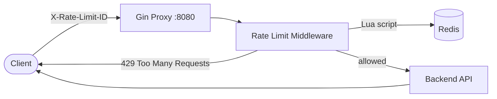

# Token Bucket Rate Limiter

> A distributed reverse proxy with per-client token bucket rate limiting, backed by Redis and built for horizontal scale.

[](https://go.dev/)
[](https://github.com/gin-gonic/gin)
[](https://redis.io/)

Sit this proxy in front of any HTTP backend. Every request is checked against a token bucket before it gets forwarded. State lives in Redis, so you can run multiple proxy instances behind a load balancer without counters drifting apart.

---

## How it works



### Token bucket algorithm

Each client gets a bucket identified by the `X-Rate-Limit-ID` header.

| Phase | What happens |
|-------|----------------|
| **Burst** | New clients start with `MAX_TOKEN` tokens |
| **Consume** | Each allowed request costs 1 token |
| **Refill** | Tokens refill continuously at `REFILL_RATE` per second |
| **Cap** | Bucket never exceeds `MAX_TOKEN` |
| **Eviction** | Idle client keys expire from Redis after 1 hour |

Refill and consume run atomically inside a Redis Lua script — no race conditions, even under heavy concurrent load.

---

## Features

- **Reverse proxy** — forwards all traffic to a configurable backend
- **Per-client rate limiting** — keyed on `X-Rate-Limit-ID`
- **Redis-backed state** — shared across multiple proxy replicas
- **Atomic Lua script** — refill + consume in a single round trip
- **TTL eviction** — stale buckets are cleaned up automatically
- **Env-driven config** — tune limits without recompiling
- **Load test harness** — `test/brute.py` hammers the proxy and reports block/unblock timing

---

## Project structure

```
ratelimiter/
├── main.go                 # Gin server + reverse proxy wiring
├── config/                 # .env loading and app config
├── middleware/             # Rate limit Gin middleware
├── cache/
│   ├── redis.go            # Redis Lua token bucket
│   ├── memory_cache.go     # In-memory implementation (dev/local)
│   └── bucket.go           # Token bucket math
├── services/               # Dependency injection / service wiring
├── test/
│   └── brute.py            # Concurrent load test script
├── Dockerfile              # Redis container
└── .env                    # Runtime configuration
```

---

## Quick start

### Prerequisites

- Go 1.26+
- Docker (for Redis)
- A backend service to proxy to (e.g. anything on `:9001`)

### 1. Configure environment

Create a `.env` file in the project root:

```env
PROXY_ADDR=localhost:8080
BACKEND_URL=http://localhost:9001
MAX_TOKEN=100
REFILL_RATE=0.2
REDIS_ADDR=localhost:6379
REDIS_PASSWORD=your_password_here
```

| Variable | Description |
|----------|-------------|
| `PROXY_ADDR` | Address the proxy listens on |
| `BACKEND_URL` | Upstream service to forward allowed requests to |
| `MAX_TOKEN` | Maximum bucket size (burst capacity) |
| `REFILL_RATE` | Tokens added per second |
| `REDIS_ADDR` | Redis host and port |
| `REDIS_PASSWORD` | Redis auth password |

### 2. Start Redis

```bash
docker build -t ratelimiter-redis .
docker run --env-file .env -p 6379:6379 ratelimiter-redis
```

### 3. Start the proxy

```bash
go run .
```

### 4. Send a request

```bash
curl -H "X-Rate-Limit-ID: client-abc" http://localhost:8080/
```

| Status | Meaning |
|--------|---------|
| `200` | Allowed — forwarded to backend |
| `429` | Rate limited — bucket empty |
| `500` | Missing `X-Rate-Limit-ID` header |

---

## Load testing

Hammer the proxy with concurrent workers and watch when blocking kicks in and how long until the next allowed request:

```bash
cd test
python -m venv venv && source venv/bin/activate
pip install requests
python brute.py
```

Example output:

```
Hammering http://localhost:8080/ with 25 workers (Ctrl+C to stop)

[#142] BLOCKED at 14:32:01
[#891] ALLOWED after 12.40s (status 200)
```

---

## Architecture decisions

**Why Redis + Lua?**  
A token bucket needs read → refill → consume → write as one atomic step. A Lua script in Redis gives you that without a distributed lock, and any number of proxy pods can share the same counters.

**Why `X-Rate-Limit-ID`?**  
Decouples rate limiting from IP parsing. Use a user ID, API key, or IP — whatever makes sense. Behind Cloudflare, set this from a trusted header like `CF-Connecting-IP`.

**Why a reverse proxy?**  
Drop-in protection for any existing HTTP service. No SDK, no code changes on the backend.

---

## Scaling

```
                    ┌─────────────┐
               ┌───►│  Proxy #1   │───┐
               │    └─────────────┘   │
  Load         │    ┌─────────────┐   │    ┌──────────┐
  Balancer ────┼───►│  Proxy #2   │───┼───►│  Redis   │
               │    └─────────────┘   │    └──────────┘
               │    ┌─────────────┐   │
               └───►│  Proxy #3   │───┘
                    └─────────────┘
```

Spin up N proxy instances, point them at the same Redis, and rate limits stay consistent cluster-wide.

---

## Tech stack

| Layer | Tech |
|-------|------|
| Language | Go 1.26 |
| HTTP framework | Gin |
| State store | Redis 7 |
| Config | godotenv |
| Container | Docker (Redis) |

---

## License

MIT — use it, break it, rate limit it.
